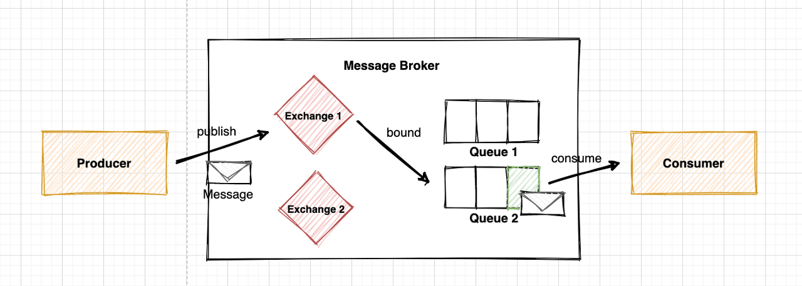
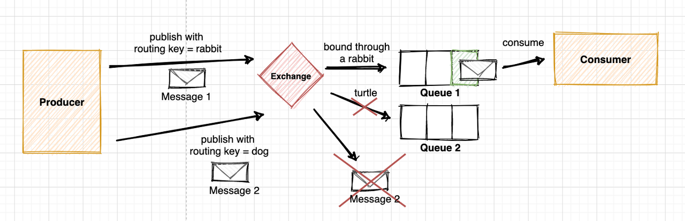
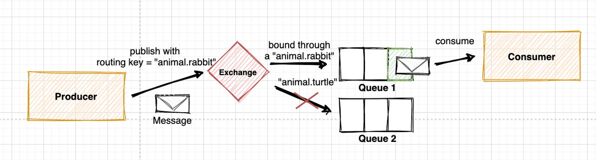
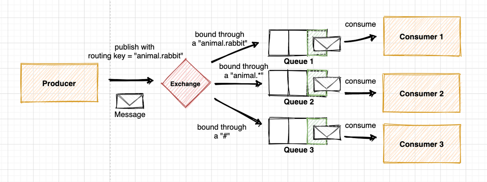
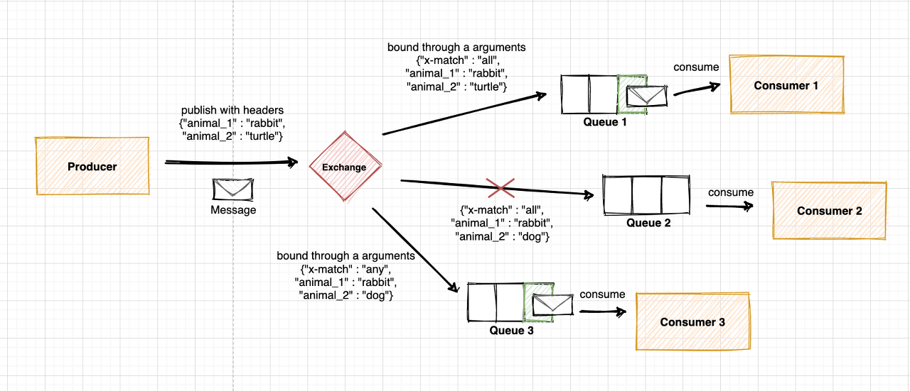
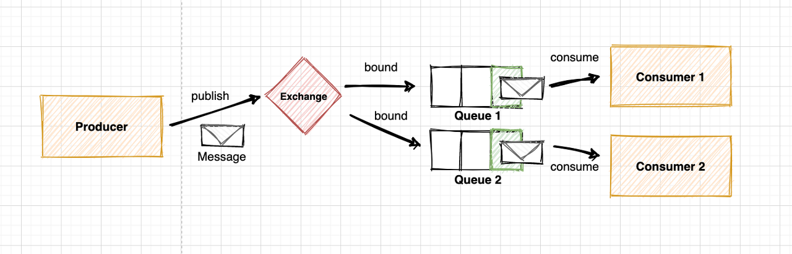
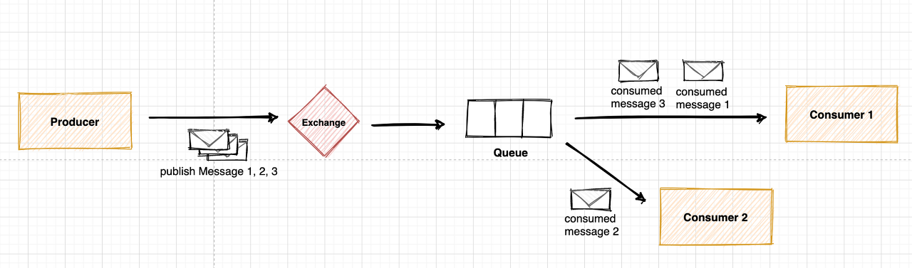

# rabbitMQ 에 대하여
> **서버 간 메세지를 전달해주는 오픈소스 메세지 브로커**  
> A → B에게 또는 A → B,C,D,E,F 등 메세지를 보내려고 할 때 RabbitMQ가 이 메세지를 받아서 전달

RabbitMQ는 ***AMQP 프로토콜**을 구현한 메세지 브로커이다.  
*AMQP란? Advanced Message Queuing Protocol로 
client application과 middleware broker와의 메세지를 주고 받기 위한 프로토콜

#### 사용하는 케이스
- 요청을 많은 사용자에게 전달할 때
- 요청에 대한 처리시간이 길 때
- 많은 작업이 요청되어 처리를 해야할 때

### 작업 흐름

**Producer** : 요청을 보내는 주체, 보내고자 하는 메세지를 exchange에 publish  
**Consumer** : producer로부터 메세지를 받아 처리하는 주체  
**Exchange** : producer로부터 전달받은 메세지를 어떤 queue로 보낼지 결정하는 장소, 4가지 타입  
**Queue** : consumer가 메세지를 consume하기 전까지 보관하는 장소  
**Binding**  
: Exchange와 Queue의 관계, 보통 사용자가 특정 exchange가 특정 queue를 binding하도록 정의 (fanout 타입 예외)

### Binding
Binding은 Exchange와 Queue를 연결하는 관계  
모든 메시지는 Exchange가 가장 먼저 수신, Exchange 타입과 binding 규칙에 따라 적절한 Queue로 전달

### Exchange 4가지 타입
**1. Direct** :	라우팅 키가 정확히 일치하는 Queue에 메시지 전송  
**2. Topic** : 라우팅 키 패턴이 일치하는 Queue에 메시지 전송  
**3. Headers** : [key:value]로 이루어진 header값을 기준으로 일치하는 Queue에 메시지 전송  
**4. Fanout** :	해당 Exchange에 등록된 모든 Queue에 메시지 전송  

#### Direct Exchange

라우팅 키를 이용하여 메시지를 전달할 때 정확히 일치하는 Queue에만 전송  
하나의 Queue에 여러 라우팅 키, 여러 Queue에 같은 라우팅 키를 지정 또한 가능  

RabbitMQ에서 사용되는 **디폴트 exchange는 Direct**  

하나의 queue에 여러개의 routing key를 지정할 수 있고  
( ex. direct example 2에서 routing key가 error 인 것 ),  
여러 queue에 동일한 routing key를 지정 가능  
( ex. direct example 2에서 두번째 queue가 routing key가 총 3개로 지정 )

⇒ 즉, 메세지의 routing key를 기반으로 queue와 1:N 가능

#### Topic Exchange
라우팅 키의 패턴을 이용해 메시지를 라우팅   
여러 Consumer에서 메시지 형태에 따라 선택적으로 수신해야하는 경우 등 다양한 패턴 구현에 활용  

→ 라우팅 키가 정확히 일치하지 않아 binding되지 않은 경우  

→ "animal.rabbit"이 "animal.* "와 "#" 모두에 일치하기 때문에 모든 Queue에 전송되는 경우  

**`*` : 단어 1개를 대체  
`#` : 0개 이상의 단어를 대체 (없거나 하나 이상의 단어를 의미)**

#### Headers Exchange

- Topic과 유사한 방법이지만 라우팅을 위해 header를 사용한다는 점에서 차이  
- producer에서 정의된 header의 key-value 쌍과 consumer에서 정의된 argument의 key-value 쌍 일치 시 binding  
- binding key 만을 사용하는 것보다 더 다양한 속성 사용 가능  
- 이 타입을 사용하면 binding key는 무시, 바인딩 시 지정된 값과 헤더 값이 같은 경우 일치하는 것으로 간주  

`x-match` 의 값에 따라 다르게 동작  

**1) x-match : all**
header의 key-value와 argument의 key-value가 정확히 일치해야 binding

**2) x-match : any**  
producer가 전송하는 header의 key-value 값과 argument의 key-value값 중  
하나라도 일치하는것이 있으면 binding

#### Fanout

Exchange에 등록된 모든 Queue에 메시지를 전송

### Prefetch Count

하나의 Queue에 여러 Consumer가 존재할 경우, Queue는 기본적으로 Round-Robun 방식으로 메시지를 분배  
- 이때 예를 들어 홀수 번째 메시지 처리 시간은 짧고, 짝수 번째 메시지 처리 시간이 매우 길 경우, 
    계속해서 하나의 Consumer만 일을 하게 될 수
  - 이를 예방하기 위해 Prefetch count를 1로 설정하면, 
  하나의 메시지가 처리되기 전에는 새로운 메시지를 받지 않게 되므로 작업을 분산 가능
