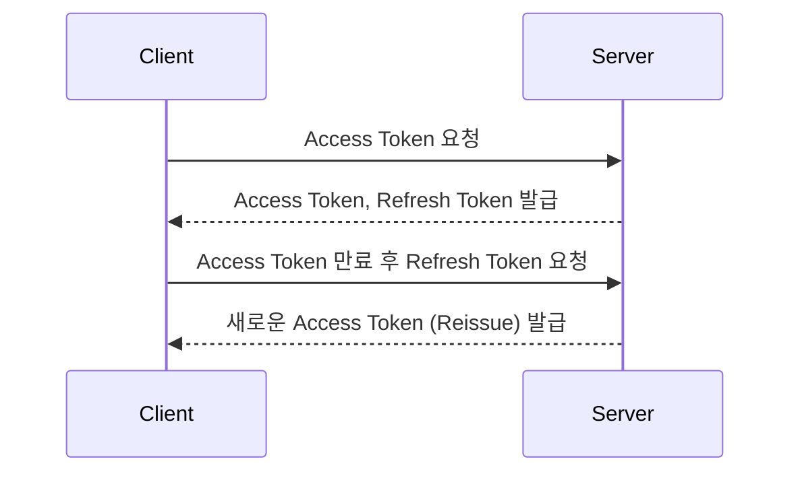

# Access Token, Refresh Token, Reissue Token

### 1. **Access Token (액세스 토큰)**  
사용자 인증(로그인)이 완료된 후 서버가 발급하는 토큰  
클라이언트는 이 토큰을 API 요청에 포함시켜 인증된 요청임을 증명한다.  

- **특징:**  
  - 유효기간이 짧음 (일반적으로 수 분 ~ 수십 분)  
  - 노출되면 보안에 취약하므로 안전하게 관리해야 함  

- **사용 예시:**  
  - `Bearer <access_token>` 형태로 Authorization 헤더에 포함하여 요청  

### 2. **Refresh Token (리프레시 토큰)**  
Access Token이 만료되었을 때 새로운 Access Token을 발급받기 위해 사용되는 토큰  
서버는 클라이언트의 Refresh Token 요청을 확인하고 새로운 Access Token을 발급   

- **특징:**  
  - 유효기간이 비교적 길음 (몇 시간 ~ 며칠 또는 몇 주)  
  - 안전하게 관리되기 위해 서버 또는 보안 저장소에 저장되어야 함  

- **사용 예시:**  
  - Refresh Token을 이용해 `/reissue` API 호출  

### 3. **Reissue Token (재발급 토큰)**  
Refresh Token을 통해 새로운 Access Token 및 경우에 따라 새로운 Refresh Token도 발급하는 과정   

- **특징:**  
  - 클라이언트는 주기적으로 Refresh Token을 사용해 새로운 Access Token을 받아야 함  
  - 보안 강화를 위해 Refresh Token이 갱신되기도 함  

- **사용 흐름:**  

---

### **Access, Refresh, Reissue Token 관계 예시**  

| 종류          | 설명                                                                 | 유효기간 | 저장 위치 |
|---------------|-----------------------------------------------------------------------|---------|-----------|
| Access Token  | API 요청 시 인증 정보를 전달하는 토큰                                | 짧음    | 메모리 또는 쿠키 |
| Refresh Token | 새로운 Access Token 발급을 위해 사용되는 토큰                        | 김      | 보안 저장소 (예: HttpOnly 쿠키) |
| Reissue Token | Refresh Token으로 새로운 Access Token 재발급하는 과정 | N/A     | N/A       |
